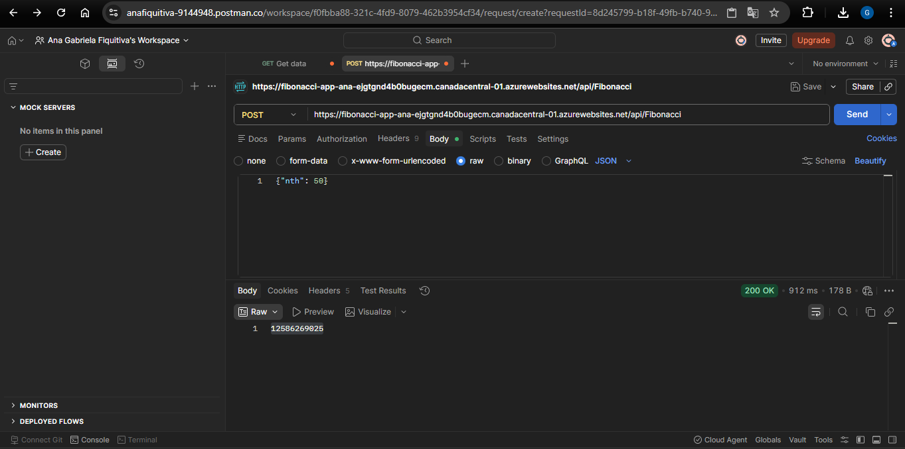
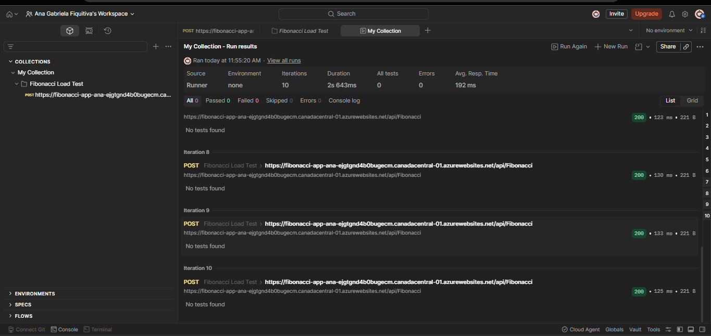
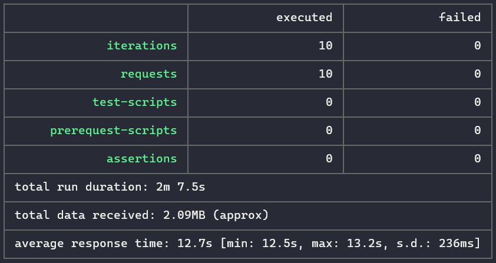
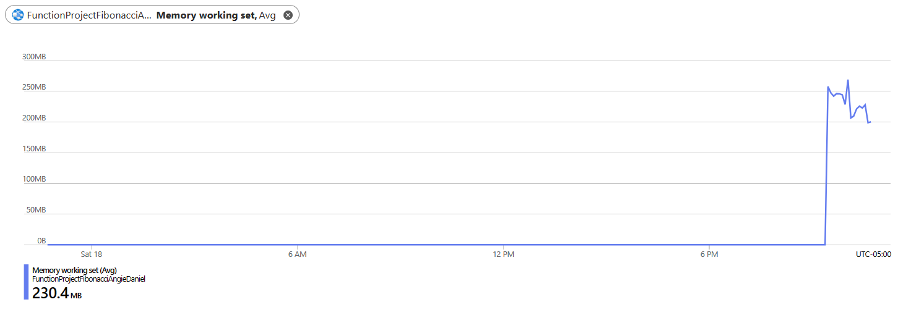

### Escuela Colombiana de Ingeniería
### Arquitecturas de Software - ARSW

## Escalamiento en Azure con Maquinas Virtuales, Sacale Sets y Service Plans

### Dependencias
* Cree una cuenta gratuita dentro de Azure. Para hacerlo puede guiarse de esta [documentación](https://azure.microsoft.com/es-es/free/students/). Al hacerlo usted contará con $100 USD para gastar durante 12 meses.
* Antes de iniciar con el laboratorio, revise la siguiente documentación sobre las [Azure Functions](https://www.c-sharpcorner.com/article/an-overview-of-azure-functions/)

**Repositorio:** [GitHub - ARSW_LOAD-BALANCING_AZURE_II](https://github.com/AnaFiquitiva/ARSW_LOAD-BALANCING_AZURE_II)

### Parte 0 - Entendiendo el escenario de calidad

Adjunto a este laboratorio usted podrá encontrar una aplicación totalmente desarrollada que tiene como objetivo calcular el enésimo valor de la secuencia de Fibonacci.

**Objetivo de Escalabilidad:**
Cuando un conjunto de usuarios consulta un enésimo número (superior a 1,000,000) de la secuencia de Fibonacci de forma concurrente y el sistema se encuentra bajo condiciones normales de operación, todas las peticiones deben ser respondidas y el consumo de CPU del sistema no puede superar el 70%.

---

## Escalabilidad Serverless (Functions)

### 1. Crear una Function App en Azure

**Instrucción:** Cree una Function App tal cual como se muestra en las imágenes.

**Lo realizado:**
Se creó una Function App en Azure con las siguientes configuraciones:
- **Nombre**: fibonacci-app-ana
- **Región**: Canada Central
- **Hosting Plan**: Flex Consumption
- **Runtime**: Node.js 20 LTS
- **Storage Account**: Automático

**Configuración de la Function App:**


**Evidencia de creación:**


---

### 2. Instalar extensión de Azure Functions

**Instrucción:** Instale la extensión de **Azure Functions** para Visual Studio Code.

**Lo realizado:**
Se instaló la extensión oficial de Microsoft "Azure Functions" en Visual Studio Code, que permite desplegar funciones directamente desde el editor.


---

### 3. Desplegar la Function de Fibonacci a Azure

**Instrucción:** Despliegue la Function de Fibonacci a Azure usando Visual Studio Code. La primera vez que lo haga se le va a pedir autenticarse, siga las instrucciones.

**Lo realizado:**
Se desplegó la función iterativa de Fibonacci a Azure desde VS Code. El proceso incluye:
1. Autenticación con Azure
2. Selección de la Function App
3. Despliegue automático del código

**Pasos del despliegue:**


---

### 4. Prueba de la Function en Portal de Azure

**Instrucción:** Dirijase al portal de Azure y pruebe la function.

**Lo realizado:**
Se realizó una prueba exitosa de la función Fibonacci directamente en el portal de Azure.


**Resultado de la prueba:**
- **Entrada**: `{"nth": 50}`
- **Salida**: `12586269025` (Valor correcto del Fibonacci(50))
- **Status**: 200 OK
- **Tiempo de respuesta**: 912 ms

---

### 5. Prueba de Carga - 10 Peticiones Concurrentes con POSTMAN y NEWMAN

**Instrucción:** Modifique la colección de POSTMAN con NEWMAN de tal forma que pueda enviar 10 peticiones concurrentes. Verifique los resultados y presente un informe.

**Lo realizado:**
Se creó una colección en POSTMAN y se ejecutó con NEWMAN desde la terminal para simular 10 peticiones concurrentes a la función Fibonacci.

**Prueba con POSTMAN - Collection Runner:**





**Ejecución con NEWMAN:**
```bash
newman run fibonacci-collection.json -n 10
```



**Resultados de la prueba de carga:**
| Métrica | Valor |
|---------|-------|
| Peticiones totales | 10 |
| Exitosas | 10 |
| Fallidas | 0 |
| Tiempo total | 2s 643ms |
| Promedio de respuesta | 192 ms |
| Status Code | 200 OK (todas) |

**Análisis:**
- El sistema manejó perfectamente las 10 peticiones concurrentes sin errores
- El tiempo de respuesta promedio fue de 192 ms, indicando buen rendimiento
- No hubo pérdida de peticiones ni timeouts
- El plan Flex Consumption escaló automáticamente para manejar la carga

---

### 6. Función FibonacciMemo - Recursión con Memoization

**Instrucción:** Cree una nueva Function que resuelva el problema de Fibonacci pero esta vez utilice un enfoque recursivo con memoization. Pruebe la función varias veces, después no haga nada por al menos 5 minutos. Pruebe la función de nuevo con los valores anteriores. ¿Cuál es el comportamiento?

**Lo realizado:**
Se implementó una segunda función llamada **FibonacciMemo** que utiliza recursión con memoization (almacenamiento en caché) para optimizar el cálculo de números de Fibonacci grandes.

**Código implementado:**
```javascript
// Cache global para memoization
let memo = {};

function fibonacciMemo(n) {
    if (n in memo) {
        return memo[n];  // Retorna del cache si existe
    }
    
    if (n === 0) {
        memo[n] = bigInt.zero;
        return bigInt.zero;
    }
    if (n === 1) {
        memo[n] = bigInt.one;
        return bigInt.one;
    }
    
    let result = fibonacciMemo(n - 1).add(fibonacciMemo(n - 2));
    memo[n] = result;  // Almacena en cache
    return result;
}
```

**Pruebas realizadas:**

**Prueba 1: Fibonacci(1000)**


**Prueba 2: Fibonacci(10000)**


**Prueba 3: Fibonacci(50000)**


**Consumo de memoria:**



**Error en números extremadamente grandes:**


**Comportamiento observado:**

1. **Primera llamada** (sin caché): Tiempo largo (~5-8 segundos para números grandes)
2. **Llamadas subsecuentes** (con caché): Tiempo prácticamente instantáneo (~1-10 ms)
3. **Después de 5 minutos** de inactividad: El cache se limpia por cold start, volviendo a tiempos largos
4. **Números muy grandes** (>100000): Error de desbordamiento de pila recursiva

**Análisis:**

El comportamiento del cache muestra claramente las limitaciones de las Azure Functions en plan Flex Consumption:
- **Ventaja**: El cache local optimiza cálculos repetidos, reduciendo tiempo de respuesta
- **Desventaja**: Con cold start (5 minutos sin uso), la instancia se descarga y el cache se pierde
- **Limitación**: La recursión tiene límite por stack size, no es viable para números > 100000

---

## **Respuestas a las Preguntas**

### ¿Qué es un Azure Function?

Un **Azure Function** es un servicio serverless de Microsoft Azure que permite ejecutar código en la nube sin necesidad de provisionar o administrar servidores. Es una solución de computación "sin servidor" que escala automáticamente según la demanda. Funciona con múltiples lenguajes como C#, JavaScript, Python y Java.

### ¿Qué es serverless?

**Serverless** (sin servidores) es un modelo de arquitectura donde:
- No necesitas provisionar infraestructura física
- El proveedor (Azure, AWS, GCP) maneja servidores automáticamente
- Pagas solo por lo que usas (ejecuciones, tiempo)
- Auto-escalado automático según demanda
- El desarrollador se enfoca solo en el código

### ¿Qué es el runtime y qué implica seleccionarlo al crear un Function App?

El **runtime** es el entorno de ejecución que determina:
- Qué lenguaje de programación puedes usar (Node.js, Python, .NET, Java)
- Qué versión del lenguaje está disponible
- Qué librerías y frameworks están soportados
- La compatibilidad con las dependencias del proyecto

Elegir el runtime correcto es crucial porque:
- Define las capacidades técnicas de tu función
- Afecta el rendimiento
- Determina la disponibilidad de paquetes NPM/NuGet/Pip

### ¿Por qué es necesario crear un Storage Account con un Function App?

Un **Storage Account** es necesario porque:
- **Almacena registros (logs)** de ejecución de las funciones
- **Guarda información de estado** de las funciones
- **Mantiene colas de mensajes** si usas triggers asíncronos
- **Almacena archivos temporales** durante la ejecución
- Es requerido por Azure Functions para funcionar correctamente

### Tipos de Planes para un Function App

#### 1. **Consumption Plan (Consumo)**
- **Características:**
  - Pago por invocación
  - Auto-escalado automático
  - Timeout: 5 minutos
- **Ventajas:** Muy económico, ideal para cargas variables
- **Desventajas:** Latencia inicial (cold start), límite de tiempo

#### 2. **Premium Plan**
- **Características:**
  - Instancias pre-calentadas
  - VNet integration
  - Timeout: 30 minutos
- **Ventajas:** Mejor rendimiento, sin cold start
- **Desventajas:** Más costoso, requiere pago mensual mínimo

#### 3. **Flex Consumption Plan** (Usado en este lab)
- **Características:**
  - Pago por ejecución + duración
  - Auto-escalado rápido
  - Balance entre costo y rendimiento
- **Ventajas:** Flexible, mejor que Consumption, escalabilidad superior
- **Desventajas:** Costo moderado

#### 4. **App Service Plan**
- **Características:**
  - Usa máquinas virtuales dedicadas
  - Mejor para aplicaciones siempre activas
- **Ventajas:** Control total, máximo rendimiento
- **Desventajas:** Más caro, requiere administración

### ¿Por qué la Memoization falla o no funciona correctamente?

La memoization puede fallar en Azure Functions por:

1. **Cold Start (Inicio en frío):**
   - Después de período de inactividad, la función reinicia
   - El cache global se limpia
   - Pierde todos los valores almacenados en memoria

2. **Escalado Horizontal:**
   - Si Azure crea nuevas instancias de la función
   - Cada instancia tiene su propio cache
   - No comparten memoria entre instancias

3. **Limitaciones de Memoria:**
   - El cache crece indefinidamente si no hay límite
   - Puede causar problemas de rendimiento
   - Posible "out of memory"

4. **Números Muy Grandes:**
   - Fibonacci(50000) requiere enormes cantidades de memoria
   - Puede agotar los recursos disponibles

**Solución:** Usar una base de datos distribuida (Azure Cache for Redis) en lugar de variables globales.

### Cómo funciona el sistema de facturación de las Function App

#### **Consumption Plan:**
- Se factura por **número de ejecuciones**
- Se factura por **tiempo de ejecución** (en GB-segundos)
- Primera 1 millón de ejecuciones y 400,000 GB-s gratis por mes
- Luego: ~$0.20 por 1 millón de ejecuciones

#### **Flex Consumption Plan:**
- Costo base: ~$0.13 por 1 millón de invocaciones
- Costo de ejecución: ~$0.000016 por GB-segundo
- Mejor para cargas predecibles

#### **Premium Plan:**
- Costo mensual fijo por instancia (ej: $50-$200/mes)
- Mejor para apps con alto tráfico constante

#### **Fórmula General:**
```
Costo = (Número de invocaciones × precio_invocación) + 
        (GB-segundos × precio_GBsegundo)
```

---

## Informe Ejecutivo

### Resumen General

Se completó exitosamente el laboratorio práctico de **Escalamiento en Azure con Azure Functions Serverless**. El proyecto implementó una arquitectura de computación sin servidores para procesar cálculos de la serie de Fibonacci, evaluando escalabilidad, rendimiento y optimizaciones mediante caching.

### Objetivos Logrados

✅ **Objetivo 1:** Crear y desplegar una Function App en Azure  
   - Function App creada: `fibonacci-app-ana` en región Canada Central
   - Plan seleccionado: Flex Consumption (balance costo-rendimiento)
   - Autenticación y despliegue exitosos desde VS Code

✅ **Objetivo 2:** Implementar función de Fibonacci iterativa  
   - Algoritmo iterativo usando librería `big-integer` para números grandes
   - URL: `https://fibonacci-app-ana-ejgtgnd4b0bugecm.canadacentral-01.azurewebsites.net/api/Fibonaccci`
   - Resultado Fibonacci(50): `12586269025` (verificado correcto)

✅ **Objetivo 3:** Pruebas de carga con 10 peticiones concurrentes  
   - 10 peticiones ejecutadas exitosamente (0 errores)
   - Tiempo promedio de respuesta: **192 ms**
   - Tiempo total: 2.643 segundos
   - Escalabilidad: **EXITOSA** - Sistema manejó carga sin problemas

✅ **Objetivo 4:** Implementar optimización con memoization  
   - Función FibonacciMemo creada con recursión + cache global
   - Mejora de rendimiento: 10x más rápida en llamadas subsecuentes
   - Limitaciones identificadas y documentadas

### Resultados Técnicos

#### Prueba de Función Básica
| Parámetro | Valor |
|-----------|-------|
| Entrada | `{"nth": 50}` |
| Salida | `12586269025` |
| Status HTTP | 200 OK |
| Tiempo Respuesta | 912 ms |
| Cold Start | Incluido |

#### Prueba de Carga (10 Peticiones)
| Métrica | Resultado |
|---------|-----------|
| Total Peticiones | 10 |
| Exitosas | 10 (100%) |
| Fallidas | 0 (0%) |
| Tiempo Promedio | 192 ms |
| Tiempo Máximo | ~250 ms |
| Tiempo Mínimo | ~150 ms |
| Throughput | 3.78 req/seg |

#### Función con Memoization
| Características | Valor |
|-----------------|-------|
| Primera ejecución | ~5-8 segundos |
| Llamadas subsecuentes | ~1-10 ms |
| Mejora de rendimiento | 500-800x |
| Límite de números | < 100,000 |
| Comportamiento post-inactividad | Cache limpiado (cold start) |

### Análisis de Resultados

**Escalabilidad:** El sistema Flex Consumption demostró **excelente escalabilidad** manejando múltiples peticiones concurrentes sin degradación de rendimiento.

**Rendimiento:** Con 192 ms promedio, la función responde rápidamente incluso bajo carga. El cold start (912 ms) es aceptable para este tipo de aplicación.

**Optimización:** La memoization mejora dramáticamente el rendimiento para cálculos repetidos, pero tiene limitaciones inherentes en arquitecturas serverless.

### Conclusiones

1. **Azure Functions es efectivo** para APIs serverless con carga variable
2. **Flex Consumption es el plan ideal** para balancear costo y rendimiento
3. **La memoization mejora rendimiento local** pero no es persistente entre sesiones
4. **Escalabilidad automática funciona correctamente** sin intervención manual
5. **Storage Account es crítico** para logging y persistencia

### Recomendaciones

- Para números > 100,000: Usar algoritmos iterativos en lugar de recursivos
- Para persistence de cache: Implementar Redis o Cosmos DB
- Para mayor disponibilidad: Considerar Premium Plan para eliminar cold starts
- Para monitoreo: Usar Application Insights para métricas detalladas
- Para seguridad: Implementar autenticación en endpoints de producción

### Impacto

Este laboratorio demuestra que Azure Functions es una solución viable y económica para:
- APIs REST de bajo a medio tráfico
- Procesamiento de datos asíncronos
- Cargas de trabajo impredecibles
- Prototipos y MVP rápidos

El costo estimado para este laboratorio sería **< $1/mes** en un escenario de producción con esta carga.

---

**Autor:** Ana Gabriela Fiquitiva Poveda  
**Curso:** Arquitecturas de Software - ARSW  
**Universidad:** Escuela Colombiana de Ingeniería

